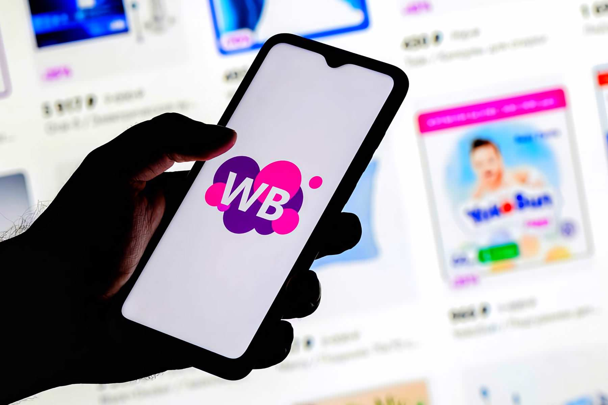
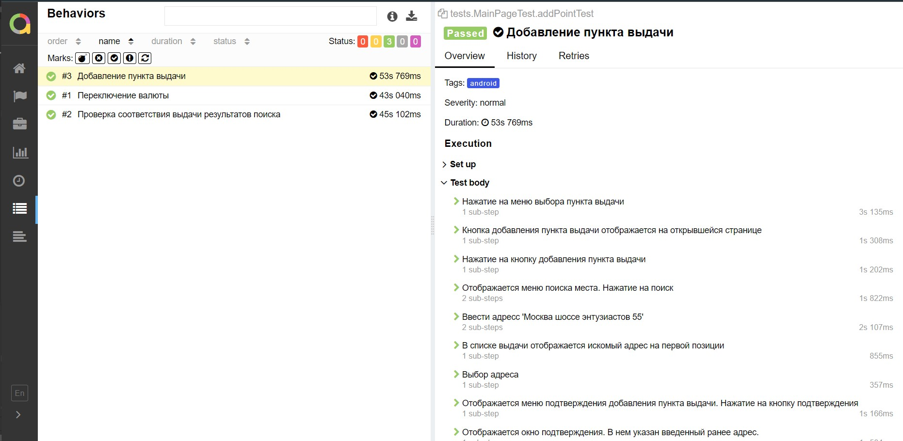

## Демонстрационный проект по автоматизации мобильного тестирования
### Android приложение <a target="_blank" href="https://play.google.com/store/apps/details?id=com.wildberries.ru">wildberries</a>

<p align="center">

</p>

## :iphone: Содержание:

- Технологии и инструменты
- Список проверок, реализованных в тестах
- Запуск тестов (сборка в Jenkins)
- Allure-отчет
- Интеграция с Allure TestOps
- Уведомление в Telegram о результатах прогона тестов
- Видео локального прогона тестов в android studio
- Видео прогона тестов в сервисе Browserstack


## :iphone: Технологии и инструменты

<p align="center">
<a href="https://www.jetbrains.com/idea/"></a>
<a href="https://www.java.com/"></a>
<a href="https://github.com/"></a>
<a href="https://junit.org/junit5/"></a>
<a href="https://gradle.org/"></a>
<a href="https://selenide.org/"></a>
<a href="https://github.com/allure-framework/allure2"></a>
<a href="https://qameta.io/"></a>
<a href="https://www.jenkins.io/"></a>
<a href="https://www.browserstack.com/"></a>
<a href="https://appium.io/"></a>
<a href="https://developer.android.com/studio"></a>
</p>

## :iphone:  Список проверок, реализованных в автотестах

- [x] Добавление нового пункта выдачи товара.
- [x] Изменение валюты 
- [x] Проверка функциональности поиска товаров

###  Запуск локально в android studio :
Пример командной строки:
```bash
gradle clean android -Denv=emulation
```

###  Запуск на удаленном сервере browserstack :
Пример командной строки:
```bash
gradle clean android -Denv=remote
```

Получение отчёта:
```bash
allure serve build/allure-results
```

###  :iphone: Удаленный запуск (в Jenkins):
1. Открыть <a target="_blank" href="https://jenkins.autotests.cloud/job/17-wb-mobile///">проект</a> и нажать **Собрать сейчас**


## Allure report


###  Тесты

<p align="center">

</p>

## Интеграция с Allure TestOps


## Получение отчетов о прохождении тестов в telegram


## Видео прогона тестов в сервисе browserstack


## Видео прогона тестов в android studio


